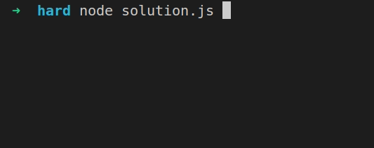
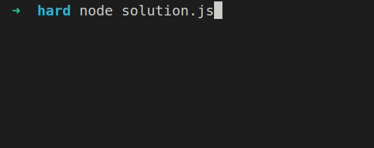

# Mario DS (Hard)

#### Estimated time 60 minutes

Mario DS adalah sebuah game asli buatan nintendo yang intinya ada karakter yang bergerak untuk mencapai finish. Terdapat juga rintangan harus dilewati dengan cara melompati. Game akan berakhir dengan dua kondisi, yaitu:

- Karakter menang
- Karakter stuck sampai dengan step tertentu

## Release 0 (Print board)

Untuk menampilkan boardnya buatlah sebuah function yang hanya bertugas untuk merubah stringBoard menjadi bentukan board.

```javascript
function printBoard(strTrack, lengthTrack) {
    // proses untuk menggambarkan board berdasarkan named arguments yang telah disediakan
}

const board = printBoard(stringOfTrack, lengthOfTrack)
```

- stringOfTrack (string)
- lengthOfTrack (number)

```
const stage1 = 'oooooooooooooooo';
const lengthStage1 = 4;
const boards1 = printBoard(stage1, lengthStage1);
expected of console log boards1:
[ [ ' ', ' ', ' ', ' ' ],
  [ ' ', ' ', ' ', ' ' ],
  [ ' ', ' ', ' ', ' ' ],
  [ ' ', ' ', ' ', ' ' ] ]
const stage2 = 'oooooooooooooooooxoo';
const lengthStage2 = 5;
const boards2 = printBoard(stage2, lengthStage2);
expected of console log boards2:
[ [ ' ', ' ', ' ', ' ', ' ' ],
  [ ' ', ' ', ' ', ' ', ' ' ],
  [ ' ', ' ', ' ', ' ', ' ' ],
  [ ' ', ' ', 'x', ' ', ' ' ] ]
const stage3 = 'oxooxooxooxo';
const lengthStage3 = 3;
const boards3 = printBoard(stage3, lengthStage3);
expected of console log boards3:
[ [ ' ', 'x', ' ' ],
  [ ' ', 'x', ' ' ],
  [ ' ', 'x', ' ' ],
  [ ' ', 'x', ' ' ] ]
const stage4 = 'ooooooooooxooooooxxooooxxxooooxxxoooxxxxxo';
const lengthStage4 = 7;
const boards4 = printBoard(stage4, lengthStage4);
expected of console log boards4:
[ [ ' ', ' ', ' ', ' ', ' ', ' ', ' ' ],
  [ ' ', ' ', ' ', 'x', ' ', ' ', ' ' ],
  [ ' ', ' ', ' ', 'x', 'x', ' ', ' ' ],
  [ ' ', ' ', 'x', 'x', 'x', ' ', ' ' ],
  [ ' ', ' ', 'x', 'x', 'x', ' ', ' ' ],
  [ ' ', 'x', 'x', 'x', 'x', 'x', ' ' ] ]
```

## Release 1 (Mario Last Position)

Tentukkan dimanakah posisi terakhir mario. Function ini berfungsi hanya untuk **menampilkan** output yang diminta.

- jumpPower (number)
- boards (from release 0)

```javascript
function marioLastPosition(jumpPower, boards) {
    // proses untuk menentukkan posisi terakhir
}

marioLastPosition(jumpPower, boards);

const jumpPowerStage1 = 0;
const jumpPowerStage2 = 3;
const jumpPowerStage3 = 6;
expected result stage 1 => 'Congratulations you win the game'
expected result stage 2 => 'Congratulations you win the game'
expected result stage 3 => 'Oops! You stuck at the step 0'
```

## Release 2 (Move Animation)

Cukup solve stage 1, dimana mario hanya bergerak dan menang. Ditambahkan dua fungsi animation untuk membantu yaitu sleep dan clearScreen. Apabila sudah sampai finish maka tampilkan pesan dari release 1.

```javascript
function clearScreen () {
  // Un-comment this line if you have trouble with console.clear();
  // return process.stdout.write('\033c');
  console.clear();
}

function sleep (milliseconds) {
  var start = new Date().getTime();
  for (var i = 0; i < 1e7; i++) {
    if ((new Date().getTime() - start) > milliseconds) {
      break;
    }
  }
}

function animate(boards) {
    // proses animasi dimana menggunakan printBoard, sleep, dan clearScreen
}

animate(boards);
```



## Release 3 (Jump & Fall Animation)

Cukup solve stage 2 dan 3, dimana mario bisa bergerak lompat dan jatuh. Apabila sudah sampai finish atau stuck tampilkan pesan dari release 1.

```javascript
function animate(boards) {
    // proses animasi dimana menggunakan printBoard, sleep, dan clearScreen
}

animate(boards);
```

Stage 2 animation:



Stage 3 animation: (apabila jumpPower melebihi heightOfStage maka kemampuan lompat maksimal mario hanya sampai disana)


## Release 4 (Solve Animation)

Solve stage 4. Apabila sudah sampai finish tampilkan pesan dari release 1.

```javascript
function animate(boards) {
    // proses animasi dimana menggunakan printBoard, sleep, dan clearScreen
}

animate(boards);
```

