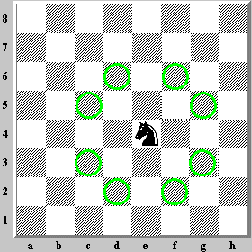

# Lompatan Kuda


> ⏰ Time limit: **50 min**

Dalam sebuah permainan catur. Bidak kuda dapat berpindah tempat seperti huruf L


Dalam permainan catur terdapat papan 8 x 8.
Tugas kamu adalah menghitung jumlah kemungkinan jalannya suatu bidak kuda dihitung dari posisi kudanya.

Bila dilihat dari contoh gambar diatas. Posisi bidak kuda berada di E4, maka output yang di harapkan adalah 8. Karena kuda dapat bergerak sebanyak 8 kemungkinan, yaitu ditunjukkan dengan warna hijau.

```javascript
console.log(lompatanKuda('C4')) // 8
console.log(lompatanKuda('G7')) // 4
console.log(lompatanKuda('A1')) // 2
```